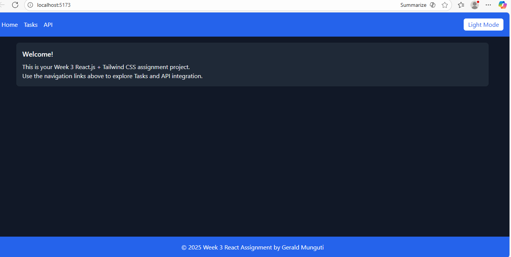
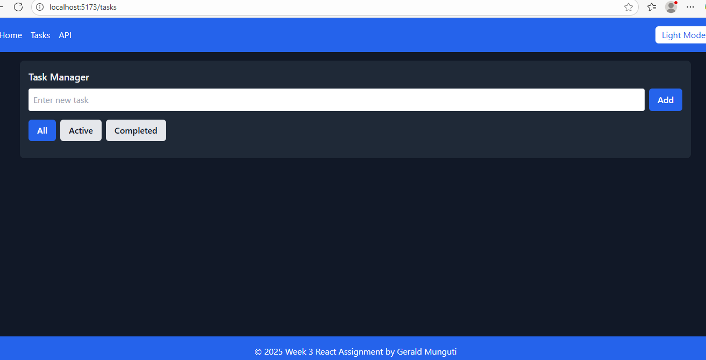
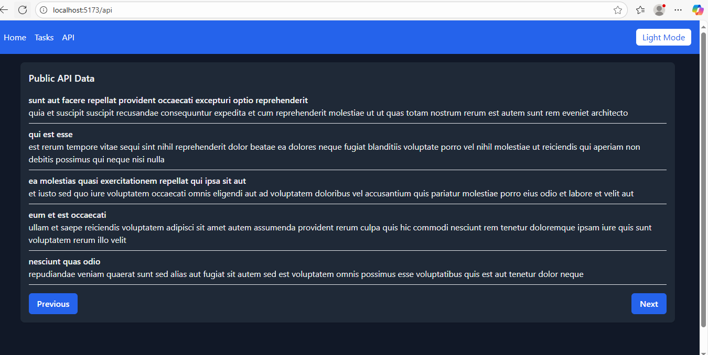

# 🌟 Week 3 React.js + Tailwind CSS Assignment

A responsive React application built using **Vite**, **Tailwind CSS**, and **React Hooks**.  
This project demonstrates component architecture, state management, custom hooks, and API integration.

---

## 🚀 **Project Overview**

This project was developed for the **Week 3 Front-End Development Assignment**.  
It showcases:

- React functional components with props  
- State management using `useState`, `useEffect`, and `useContext`  
- Custom hook (`useLocalStorage`)  
- Integration with a public API (JSONPlaceholder)  
- Responsive design using Tailwind CSS  
- Theme toggle (light/dark mode)  
- Clean folder structure and reusable UI components  

---

## 🌐 **Live Demo**

🎯 **Deployed App: react-js-jsx-and-css-mastering-fron-gules.vercel.app


## 🏗️ **Project Structure**


src/
├── api/ # API integration functions
├── components/ # Reusable UI components (Button, Card, Navbar, Footer)
├── context/ # React context (ThemeContext)
├── hooks/ # Custom hooks (useLocalStorage)
├── pages/ # Page components
├── utils/ # Helper/utility functions
└── App.jsx # Main app component


---

## ⚙️ **Setup Instructions**

### 1️⃣ Clone the Repository
```bash
git clone <your-github-repo-url>
cd week3-react-tailwind-assignment

2️⃣ Install Dependencies
npm install

3️⃣ Start Development Server
npm run dev


Your app will open automatically at http://localhost:5173

🧩 Tech Stack

⚛️ React.js (v18)

⚡ Vite (for fast builds)

🎨 Tailwind CSS

🔗 React Router DOM

🌍 Axios (for API requests)

🌍 API Integration

This app fetches data from a public API (JSONPlaceholder) and displays it dynamically.

Example Endpoint:

https://jsonplaceholder.typicode.com/posts

🪄 Features

✅ Add, complete, and delete tasks
✅ Filter tasks (All, Active, Completed)
✅ Persist tasks using localStorage
✅ Light/Dark mode toggle using React Context
✅ Fetch and display API data with loading states
✅ Responsive design for mobile, tablet, and desktop
✅ Smooth animations using Tailwind transitions

🎨 Screenshots

To include screenshots of your application:

Create a folder named screenshots in your project root

Add images like:

screenshots/homepage.png
screenshots/darkmode.png
screenshots/api-data.png


Reference them in this README like below:

### 🖼️ Home Page


### 🌗 Dark Mode


### API


🧠 Learning Objectives

Through this assignment, I practiced:

JSX structure and props handling

Component-based architecture

React hooks (useState, useEffect, useContext)

Creating a custom hook (useLocalStorage)

Using Tailwind’s utility-first design

Integrating and rendering API data

Deploying a React app using Vercel

🚀 Deployment Guide
🪣 Step 1: Push to GitHub

If you haven’t already, run these commands:

git init
git add .
git commit -m "Initial commit - Week 3 React Tailwind Assignment"
git branch -M main
git remote add origin https://github.com/<your-username>/<repo-name>.git
git push -u origin main

🌐 Step 2: Deploy to Vercel

Visit https://vercel.com

Log in with your GitHub account

Click “New Project”

Import your GitHub repository

Vercel auto-detects it’s a Vite + React app

Click Deploy

Once done, copy your deployment link (e.g. https://week3-react-tailwind.vercel.app)
Then paste it into the Live Demo section of this README.

📦 Scripts
Command	Description
npm run dev	Starts the development server
npm run build	Builds the app for production
npm run preview	Previews the production build locally
🧾 License

This project is for educational purposes only, developed as part of the Week 3 Front-End Development Assignment.

👨‍💻 Author

Gerald Munguti
Poultry Farmer | Financial Literacy Trainer | Software Engineer
📍 Machakos, Kenya
